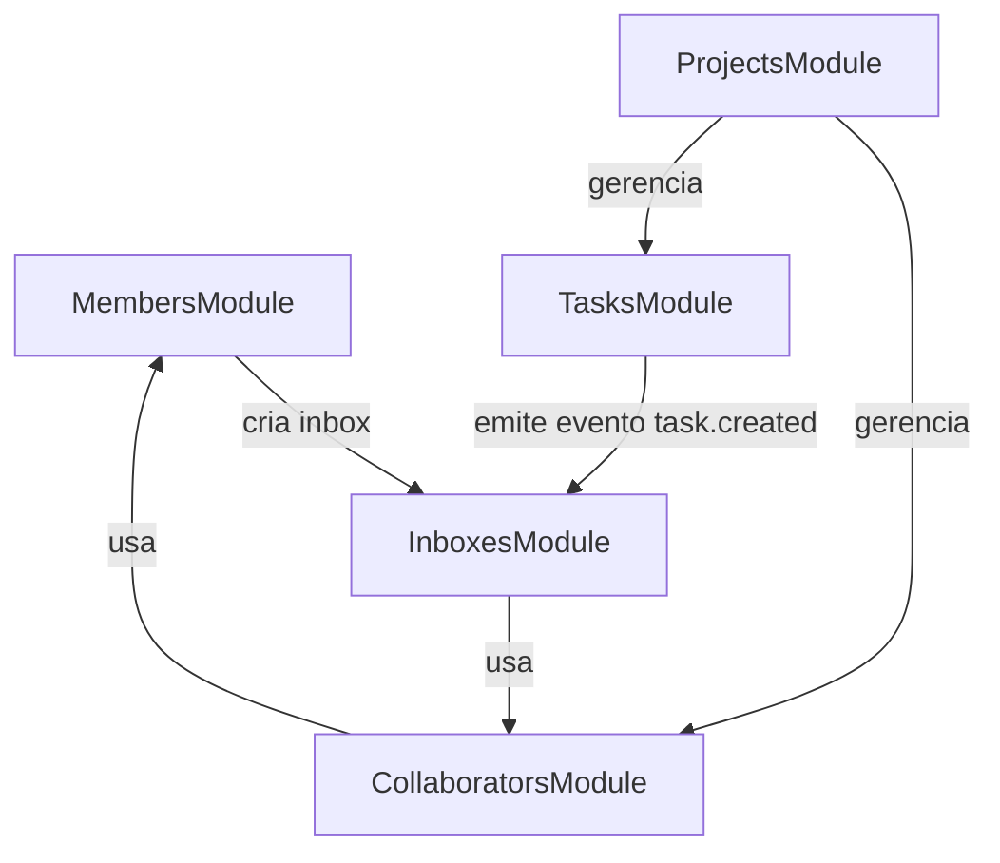
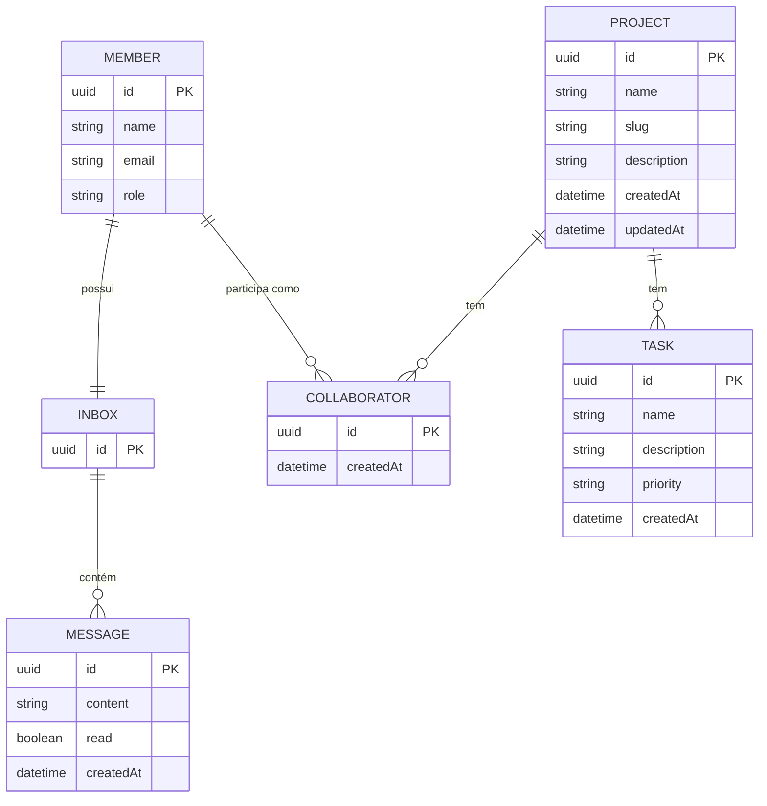
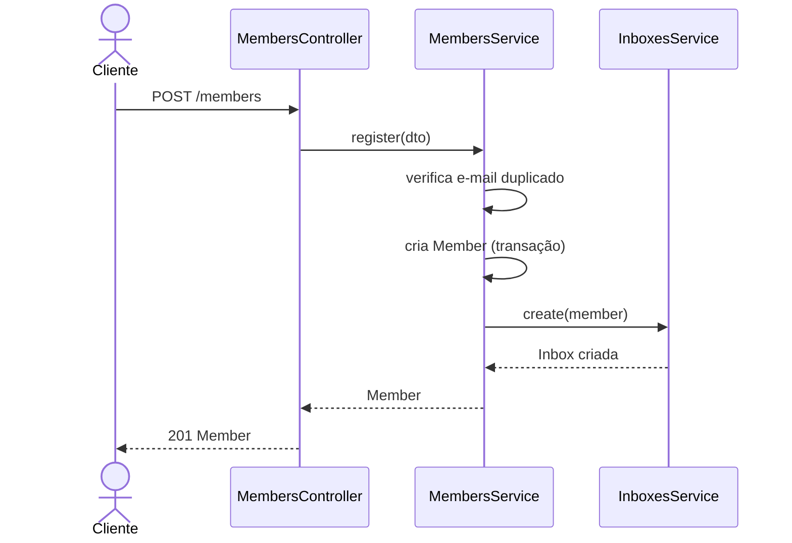
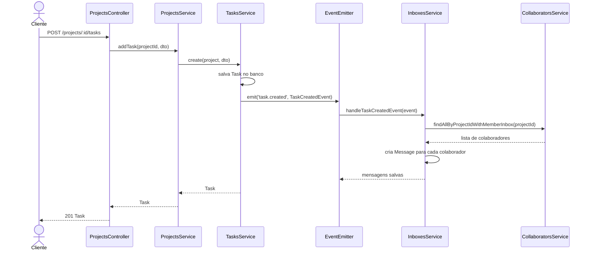
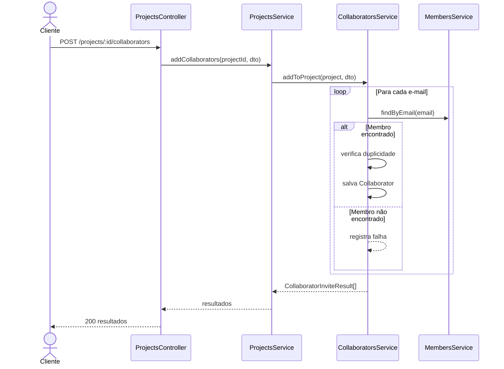

<p align="center">
  <a href="https://www.atriajr.com.br/" target="blank"></a>
</p>

<h1 align="center">APA — Atria Project Assignor</h1>

<p align="center">
  Sistema de atribuição e gerenciamento de projetos para membros da <strong>Atria Jr.</strong>, construído com <a href="https://nestjs.com" target="_blank">NestJS</a> e TypeScript.
</p>

---

## Sobre o projeto

O **APA (Atria Project Assignor/Atribuidor de Projetos da Atria)** é o backend responsável por organizar a distribuição de projetos entre os membros da empresa júnior Atria Jr. Ele permite cadastrar membros, criar projetos, adicionar colaboradores a esses projetos, criar tarefas e notificar automaticamente os colaboradores via caixa de entrada (inbox) sempre que uma nova tarefa é criada.

---

## Funcionalidades

- **Cadastro de membros** com cargo (assessorx, coordenadorx, diretorx) e criação automática de inbox
- **Criação de projetos** com slug único gerado automaticamente
- **Atribuição de colaboradores** a projetos por e-mail
- **Criação de tarefas** com prioridade (alta, normal, baixa) vinculadas a projetos
- **Notificações automáticas** via inbox para todos os colaboradores do projeto ao criar uma tarefa

---

## Arquitetura

O sistema é dividido em cinco módulos principais:



---

## Modelo de dados



---

## Fluxo principal

### Cadastro de membro e criação de inbox



### Criação de tarefa e notificação de colaboradores



### Adição de colaboradores a um projeto



---

## Endpoints da API

### Membros

| Método | Rota       | Descrição              |
|--------|------------|------------------------|
| POST   | `/members` | Cadastra um novo membro |

### Projetos

| Método | Rota                          | Descrição                              |
|--------|-------------------------------|----------------------------------------|
| POST   | `/projects`                   | Cria um novo projeto                   |
| GET    | `/projects`                   | Lista todos os projetos                |
| GET    | `/projects/:id`               | Busca projeto por ID                   |
| POST   | `/projects/:id/collaborators` | Adiciona colaboradores ao projeto      |
| GET    | `/projects/:id/collaborators` | Lista colaboradores do projeto         |
| POST   | `/projects/:id/tasks`         | Cria uma tarefa no projeto             |
| GET    | `/projects/:id/tasks`         | Lista tarefas do projeto               |

---

## Cargos disponíveis

| Valor          | Descrição     |
|----------------|---------------|
| `assessorx`    | Assessorx     |
| `coordenadorx` | Coordenadorx  |
| `diretorx`     | Diretorx      |

## Prioridades de tarefa

| Valor    | Descrição |
|----------|-----------|
| `high`   | Alta      |
| `normal` | Normal    |
| `low`    | Baixa     |

---

## Tecnologias

- [NestJS](https://nestjs.com/) — framework Node.js
- [TypeORM](https://typeorm.io/) — ORM para banco de dados
- [SQLite](https://www.sqlite.org/) — banco de dados local
- [nanoid](https://github.com/ai/nanoid) — geração de IDs únicos para slugs
- [@nestjs/event-emitter](https://docs.nestjs.com/techniques/events) — sistema de eventos para notificações

---

## Configuração do projeto

```bash
npm install
```

## Executar o projeto

```bash
# desenvolvimento
npm run start

# modo watch
npm run start:dev

# produção
npm run start:prod
```

## Testes

```bash
# testes unitários
npm run test

# testes e2e
npm run test:e2e

# cobertura
npm run test:cov
```

---

## Licença

Este projeto está sob a licença MIT.
